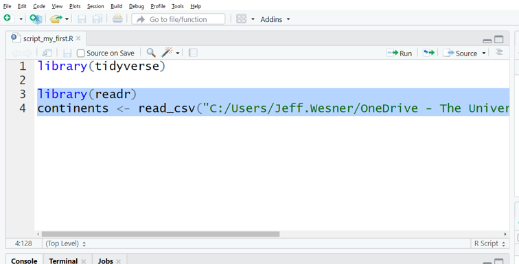

# Introduction to R

```{r include=FALSE}
library(tidyverse)
library(RefManageR)
```

**Learning Objectives**

1)  Be able to download and open R and RStudio.

2)  Understand how to import data to R.

3)  Understand how to create a graph in R.

[Link to Lecture](https://docs.google.com/presentation/d/1VJUOzvqMubmcRoJWAklv6ZlwM5WydgO7vyAwgsnPYsk/edit?usp=sharing)

## R and RStudio

So far we've discussed the nature of science and the structure of scientific papers. Now we're going to introduce a central method that is required of most modern science: scientific computing. It is almost impossible to conduct science without a computer, especially since we need to analyze data. We also need to store the data, organize it, plot it, summarize, and report it. Lots of tools do that. In this book, we use the statistical software R [@r_core_team_r_2020]. It is among the most popular programs for analyzing scientific data and it is designed specifically for the workflow we use in this book. It is also free. Here's how you get it.

1.  Download R: (<https://mirror.las.iastate.edu/CRAN/>). Follow the link above and choose your operating system - Linux, Mac OS, or Windows

2.  Download RStudio: (<https://rstudio.com/products/rstudio/download/#download>)

All of the examples in this book are generated using R [@r_core_team_r_2020]. Actually, that's not quite correct. While R is the workhorse, the examples in this book are generated through an interface to R called RStudio [@rstudio_team_rstudio_2020].

R looks like this: {width="5%"} *Download only*

RStudio looks like this: {width="5%"} *Download, open, and use*

Once you've downloaded both programs, you'll only need to open RStudio. It automatically uses R in the background. It is possible to do everything only in base R, but we prefer RStudio as a more user-friendly interface.[^introductiontor-1]

[^introductiontor-1]: Except for JR, an English professor who doesn't understand any of this. We assume he is currently pontificating about the literary importance of using *salve* versus *halve* in the writings of Chaucer (who uses neither word). JR has a large collection of feathered pens and prefers to write on low gloss paper sourced from the Pacific Northeast.

**How to Use This Chapter**

This book is not meant as a stand-alone R reference. It is meant as a companion to university-level labs and lectures, in which students can work through examples with an instructor or TA nearby to fill in the gaps and troubleshoot.

When starting R, these are the types of questions many students have:

*"Is this the right program?"* *"What is a script again?"* *"How do you make the arrow?"* *"What is that squiggly sign?"* *"I ran the code and nothing happened..."*

In other words, we expect students to have lots of questions in this new and unfamiliar environment. Everyone started this way and the easiest way to find the answers is to ask an expert.

However, there are lots of excellent R guides out there for students who are interested in learning more detail. Here are a few of our favorites:

**R for Data Science** (free) - <https://r4ds.had.co.nz/> [@grolemund_r_nodate]

**The R Book** [@crawley_r_2012]

**Getting Started with R: An Introduction for Biologists** [@beckerman_getting_2017]

**Data Visualization: A Practical Introduction** [@healy_data_2018]

**dplyr and tidyr cheatsheets** - (<https://rstudio.com/wp-content/uploads/2015/02/data-wrangling-cheatsheet.pdf>)

**ggplot2 cheatsheet** - (<https://rstudio.com/wp-content/uploads/2015/03/ggplot2-cheatsheet.pdf>)

## Data Analysis Workflow


In this book, we focus on learning a few fundamental tasks that are common to the workflow of most data science projects [@wickham_welcome_2019]. Nearly every study that includes data has a workflow similar to that above. We gather data, get it into a program (**Import**), get it in the right format (**Tidy**), and then analyze it with plots (**Visualize**), Models, Transformations, etc. When we've finished, we communicate the results to our peers. You'll learn how to complete these steps in R because its designed specifically for this type of workflow. But the workflow applies regardless of the software you use.

## Getting Started in RStudio

Before the fun stuff happens, we need to determine where things will be saved on our computer. If you'd prefer to skip this step, that is OK. Just be prepared for certain doom.

**Create a folder on your computer for your analyses**

For example, if this is for a class called Biology 280, you might create a folder called `BIO280_R`. If you have data to analyze (like an Excel file or a .csv), save it in this folder as well.

**Open RStudio**

Click the RStudio icon {width="5%"}

**Create a project**

*File -\> New Project... -\> Existing Directory -\> Browse -\>* [NAME OF YOUR FOLDER]

You only need to do this once. After you create a project, all of the work you do within that project (data analysis, graphs, text) will be saved in it. If it all goes well, you should see a screen like this, with the name of your project in the upper right hand corner.

{width="100%"}

**Open a script**

*File -\> New File -\> R Script* or *ctrl+shift+N*

You should now see a screen like the one below, with four windows.

{width="100%"}

The window on the lower right shows all of the **Files** in the folder you created on your computer. If you add something to that folder from outside of R, it will show up here as well.

The window on the upper right shows your **Environment**. When you create something in R, like a new data frame or a plot, it will show up in the Environment (But it won't be saved. More on that later).

The window on the upper left shows your **Script**. This is where you tell R what to do.

The window on the bottom left is the **Console**. It keeps a running list of all of the procedures you perform. For example, if you run code in the script, it will show up here. When something goes wrong, you'll also see the error message here.

### Install a package

Click anywhere on the script window so that you see the flashing prompt. Type the code below and then type *ctrl+enter*. (NOTE: If you just hit enter without adding ctrl, it won't work. It will just move you to the next line. Get in the habit of typing *ctrl+enter* to run your code).

```{r echo=TRUE, eval = FALSE, message=FALSE, warning=FALSE, paged.print=FALSE}
#type this and then hit ctrl+enter
install.packages("tidyverse") # ctrl+enter
```

Like this: {width="100%"}

The code above tells R to install a package called *tidyverse*. You only have to do this once. After it's installed, it will always be available when you open R, but you'll have to tell R when you want to use it each time by typing `library(tidyverse)`.

**Packages** are bits of code that someone wrote and then converted into a series of shortcuts. R has 1000's of packages for just about any task you can think of. The **tidyverse package** actually contains a bunch of other packages within it. As a result, when you install it for the first time, it will generate a lot of activity in your console, with red text and "<https://>.." links all over the place. That is all normal. Just give it a few minutes. You'll know it's done when you see the chevron `>` in the console.

### Your first script

Now you are ready for the fun parts. To begin coding your first script, we are going to take an unorthodox approach. Instead of starting with first principles, we'll start with the Visualize and Model steps from the workflow and then deconstruct that to learn the principles.

Copy the code below and paste it in your script. Then run the code (by clicking *ctrl+enter* from the first line down). Do not try to interpret it yet. There is a lot going on here. We'll break it down next.

```{r echo=TRUE, message=FALSE, warning=FALSE, paged.print=FALSE}
#Copy this code, paste it in your script, and run it.
#load a package
library(tidyverse) 

# make the data and "model" the mean and sd.
d <- mtcars %>% 
  group_by(cyl) %>% 
  mutate(mean = mean(mpg), sd = sd(mpg)) 

#plot the data
ggplot(data = d, aes(x = cyl,y = mpg)) +
  geom_point(shape = 21) +
  geom_pointrange(aes(y = mean, ymin = mean-sd, ymax = mean+sd)) +
  labs(y = "Miles Per Gallon",
       x = "Cylinders") 
```

Here is what you just did:

1)  Loaded the **tidyverse** package.

2)  Created a **data frame** *d* that was a modified version of the data frame *mtcars*.

3)  Added two new columns to *d*: one containing the mean mpg for each type of cylinder and another containing the standard deviation.

4)  Plotted miles per gallon as a function of cylinders as raw data.

5)  Added a mean and standard deviation to the plot.

6)  Modified the axis names.

If you're a normal person, this should all be mysterious. Here's the good news. The code above is about as complex as we will get in this book. It is also modular. That is crucial. It means that you don't have to know every step to get started. Each batch of code that precedes *`%>%`* or *`+`* will run by itself.

Let's break the code down into individual components:

**1) Loaded the *tidyverse* package.**

```{r echo=TRUE, message=FALSE, warning=FALSE, paged.print=FALSE}
#Copy this code, paste it in your script, and run it.
#load a package
library(tidyverse) 
```

**What it does** This code uses the function `library()` to load a package called *tidyverse*. The rest of the code depends on loading this package first.

**Did it work?** Check the output in the console (lower left window). Red text is normal. It does not necessarily mean there is an error. If you see the prompt `>`, that is a good sign. If you see words like `"there is no package called…"`, `"Error…"`, `"failed…"`, then it probably didn't work.

**Things to check if it doesn't work**

-   Did you install the package first?
-   Did you misspell anything?
-   Did you add a capital letter somewhere?
-   Did you hit *enter* instead of *ctrl-enter*?

**2) Created a data frame *d* that was a modified version of the data frame *mtcars*.**

```{r echo=TRUE, message=FALSE, warning=FALSE, paged.print=FALSE}
#Copy this code, paste it in your script, and run it.
#load a package
library(tidyverse)

d <- mtcars
```

**What it does** This code creates a **data frame** called *d* that contains all of the data that are in *mtcars*. A data frame is just a table with rows and columns. Try running `View(mtcars)` and you'll see what the data frame looks like. *mtcars* is one of many data frames that are built in to R. It contains data on things like miles per gallon, weight, and horsepower for different types of cars.

The symbol `<-` is how we assign bits of code to objects in R. It's a combination of the lesser than sign `<` and the minus sign `-`. You will use this symbol all the time.

**Did it work?** Do you see an object named *d* in the Environment window (upper right) that has "32 obs. of 11 variables"? If not, it didn't work.

Visually, the *d* in the Environment window is the only thing that will automatically show up if it worked. Another way to check is simply to view the data frame, like this:

```{r echo=TRUE, message=FALSE, warning=FALSE, paged.print=FALSE}
head(d)
```

This shows a snapshot of the first few rows of the data frame that exists in the object *d*. It is essentially the same as any other spreadsheet you might make in another program, like Excel. Each row contains information on mpg, cylinders (cyl), horsepower(hp), etc. for each type of car.

You can isolate individual columns:

```{r echo=TRUE, message=FALSE, warning=FALSE, paged.print=FALSE}
d %>% select(mpg, cyl) %>% head()
```

Or check the types of columns:

```{r echo=TRUE, message=FALSE, warning=FALSE, paged.print=FALSE}
str(d)
```

This shows that the object *d* is a data frame with 32 observations (rows) of 11 variables (columns). It also lists the variables and gives a preview of the first 10 rows. [Note: instead of a data frame, you might see the word *tibble*. That is another name for a data frame used by the *tidyverse* package. It has some important distinctions, but they are not relevant for this chapter].

**Things to check if it doesn't work**

-   Did you misspell anything?
-   Did you add a capital letter somewhere?
-   Did you hit *enter* instead of *ctrl-enter*?
-   Is there a space in the arrow `< -`? There shouldn't be.

**Challenges**

-   Give the data frame a different name other than *d*.
-   Select other columns using the *select()* function.

**3) Added two new columns to *d*: one containing the mean mpg for each type of cylinder and another containing the standard deviation.**

```{r echo=TRUE, message=FALSE, warning=FALSE, paged.print=FALSE}
#Copy this code, paste it in your script, and run it.
#load a package
library(tidyverse) 

# make the data and "model" the mean and sd
d <- mtcars %>% 
  group_by(cyl) %>% 
  mutate(mean = mean(mpg), sd = sd(mpg)) 
```

**What it does** This code adds a column summarizing the mean and sd of mpg for cars with different numbers of cylinders. We also have a new symbol `%>%` called a "pipe". You can either type it directly or use a shortcut *ctrl-shift-m*. Think of it as a way of telling R "and then...".

In sentence form, the code is saying this.

`d <- mtcars %>%`

*create a data frame called d that contains all of the data that are in mtcars **and then**...*

`group_by(cyl) %>%`

*assign each type of cylinder to a group **and then**...*

`mutate(mean = mean(mpg), sd = sd(mpg))`

*create a new column called mean that contains the mean mpg's for each type of cylinder. Also create a new column called sd that contains the standard deviation for each type of cylinder*

**Did it work?** Check the columns again with `str()`. Do you see the columns mean and sd now? Do you see the odd addendum that starts with "-attr(\*, "groups")..."? If so, then it worked.

```{r echo=TRUE, message=FALSE, warning=FALSE, paged.print=FALSE}
str(d)
```

**Things to check if it doesn't work**

-   Did you load the library `library(tidyverse)`? The pipes `%>%` only work if the *tidyverse* package is loaded.
-   Did you misspell anything?
-   Did you type out "cylinders" instead of using "cyl"? Computers don't know those are related.
-   Did you add a capital letter somewhere?
-   Did you hit *enter* instead of *ctrl-enter*?
-   Is there a space in the arrow `< -` or the pipes `% >%`? There shouldn't be.
-   Did you put the package in quotes when calling the `library()` function: `library("tidyverse")`?

**Challenges**

-   Summarize mpg by the number of gears instead of cylinders
-   Add a column that calculates the median in addition to the mean and sd

**4) Plotted miles per gallon as a function of cylinders as raw data.**

```{r echo=TRUE, message=FALSE, warning=FALSE, paged.print=FALSE}
#Copy this code, paste it in your script, and run it.
#load a package
library(tidyverse) 

# make the data and "model" the mean and sd
d <- mtcars %>% 
  group_by(cyl) %>% 
  mutate(mean = mean(mpg), sd = sd(mpg)) 

#plot the data
ggplot(data = d, aes(x = cyl,y = mpg)) +
  geom_point(shape = 21) 
```

**What it does** This code uses the powerful plotting package called **ggplot2** [@wickham_ggplot2_2016]. It included when you installed the tidyverse. The "gg" stands for "The Grammar of Graphics" [@wilkinson_grammar_2012], a fundamental set of principles for producing just about any plot you can think of (and rules for why some types of plots are better than others).

Making anything with ggplot2 usually requires at least two things: 1) a call to `ggplot(...)` where we specify the data along with the x and y axes or other aesthetics, and 2) a call to `geom_…`, where we tell ggplot2 how to plot the data. There are lots of geoms, as you can see in this cheatsheet (<https://rstudio.com/wp-content/uploads/2015/03/ggplot2-cheatsheet.pdf>). For most practices in this book, we will use `geom_point()`, which simply adds a dot for each x-y coordinate that we specified in the `aes()` function.

Once we have our base plot, everything else is added with `+`. This can be a point of confusion. The `+` has a similar meaning as the pipe `%>%`, but ggplot2 only uses `+`. Accidentally typing `%>%` instead of `+` is a common mistake even for experienced coders (like authors of textbooks about data analysis).

You can see the iterative nature of ggplot by breaking it down further, adding one thing at a time.

```{r echo=TRUE, message=FALSE, warning=FALSE, paged.print=FALSE}
#Copy this code, paste it in your script, and run it.
#load a package
library(tidyverse) 

# make the data and "model" the mean and sd
d <- mtcars %>% 
  group_by(cyl) %>% 
  mutate(mean = mean(mpg), sd = sd(mpg)) 

#Create a placeholder for a plot
ggplot()

#Assign the data frame d to the plot
ggplot(data = d) 

#Assign the aesthetics
#Put numbers from the column cyl on the x
#For each value of cyl on the x, add the corresponding value from the mpg column
ggplot(data = d, aes(x = cyl,y = mpg))

#Tell ggplot how to plot the x-y values with a geom.
ggplot(data = d, aes(x = cyl,y = mpg)) +
  geom_point()

#Change the default shape of the dots
#Any number from 1-25 will produce a different shape. (http://www.cookbook-r.com/Graphs/Shapes_and_line_types/)
ggplot(data = d, aes(x = cyl,y = mpg)) +
  geom_point(shape = 21) 
```

**Did it work?** The plot above should appear in the plot window (lower right).

**Things to check if it doesn't work**

-   Did you leave a hanging plus `+` at the end of the code? If so, remove it.
-   Did you write `ggplot2()` instead of `ggplot()`?
-   Did you remember to assign the x and y axes within the `aes()` function?
-   Did you put a pipe `%>%` instead of a plus `+`?
-   Did you misspell anything?
-   Did you type out "cylinders" instead of using "cyl"? R doesn't know those are related.
-   Did you add a capital letter somewhere?
-   Did you hit *enter* instead of *ctrl-enter*?
-   Is there a space in the arrow `< -` or the pipes `% >%`? There shouldn't be.
-   Did you put the package in quotes when calling the `library()` function: `library("tidyverse")`?
-   Did you load the library `library(tidyverse)`? The pipes `%>%` only work if the tidyverse package is loaded.

**Challenges**

-   Assign a different y variable
-   Change the shape
-   In addition to shape, make the colors green (HINT: see the cheatsheet (<https://rstudio.com/wp-content/uploads/2015/03/ggplot2-cheatsheet.pdf>))

**5) Added a mean and standard deviation to the plot.**

```{r echo=TRUE, message=FALSE, warning=FALSE, paged.print=FALSE}
#Copy this code, paste it in your script, and run it.
#load a package
library(tidyverse) 

# make the data and "model" the mean and sd
d <- mtcars %>% 
  group_by(cyl) %>% 
  mutate(mean = mean(mpg), sd = sd(mpg)) 

#plot the data
ggplot(data = d, aes(x = cyl,y = mpg)) +
  geom_point(shape = 21) +
  geom_pointrange(aes(y = mean, ymin = mean-sd, ymax = mean+sd))
```

**What it does** The new geom `geom_pointrange()` adds the mean and standard deviation to the plot. If we only typed `geom_pointrange()`, it wouldn't work. That's because the geom requires three values that we haven't assigned yet: y, ymin, and ymax. In this case, we want y to be the mean of each group. We want the error bar to range from ymin to ymax. ymin is the mean minus the standard deviation for each group mean-sd. ymax is the mean plus the standard deviation mean+sd. With those values, ggplot draws a line from ymin to ymax.

**Did it work?** The plot above should appear in the plot window (lower right).

**Things to check if it doesn't work**

-   Did you leave a hanging plus `+` at the end of the code? If so, remove it.
-   Did you write `ggplot2()` instead of `ggplot()`?
-   Did you remember to assign the x and y axes within the `aes()` function?
-   Did you put a pipe `%>%` instead of a plus `+`?
-   Did you misspell anything?
-   Did you type out "cylinders" instead of using "cyl"? R doesn't know those are related.
-   Did you add a capital letter somewhere?
-   Did you hit enter instead of ctrl-enter?
-   Is there a space in the arrow `< -` or the pipes `% >%`? There shouldn't be.
-   Did you put the package in quotes when calling the `library()` function: `library("tidyverse")`?
-   Did you load the library `library(tidyverse)`? The pipes `%>%`only work if the tidyverse package is loaded.

**6) Modified the axis names.**

```{r echo=TRUE, message=FALSE, warning=FALSE, paged.print=FALSE}
#Copy this code, paste it in your script, and run it.
#load a package
library(tidyverse) 

# make the data and "model" the mean and sd
d <- mtcars %>% 
  group_by(cyl) %>% 
  mutate(mean = mean(mpg), sd = sd(mpg)) 

#plot the data
ggplot(data = d, aes(x = cyl,y = mpg)) +
  geom_point(shape = 21) +
  geom_pointrange(aes(y = mean, ymin = mean-sd, ymax = mean+sd)) +
  labs(y = "Miles Per Gallon",
       x = "Cylinders") 
```

**What it does** The function `labs()` replaces the title of the x and y axis with whatever we put in quotes.

**Did it work?** The plot above should appear in the plot window (lower right).

**Things to check if it doesn't work**

-   Did you remember the comma?
-   Did you switch the x and y?
-   Did you leave a hanging plus + at the end of the code? If so, remove it.
-   Did you write `ggplot2()` instead of `ggplot()`?
-   Did you remember to assign the x and y axes within the `aes()` function?
-   Did you put a pipe `%>%` instead of a plus `+`?
-   Did you misspell anything?
-   Did you type out "cylinders" instead of using "cyl"? R doesn't know those are related.
-   Did you add a capital letter somewhere?
-   Did you hit enter instead of ctrl-enter?
-   Is there a space in the arrow `< -` or the pipes `% >%`? There shouldn't be.
-   Did you put the package in quotes when calling the `library()` function: `library("tidyverse")`?
-   Did you load the library `library(tidyverse)`? The pipes `%>%` only work if the tidyverse package is loaded.

**Challenges**

-   Rename the x and y axes
-   Add a title within the `labs()` function using `title = "put your title here"`

### Importing your own data to RStudio

To **get your own data into R**, first save the data into the same folder as your project.

Look in the lower right panel of RStudio. Click on "Files". Do you see the data set you saved? Click on it and choose Import Dataset....

Like this:


After you click Import Dataset...., you'll see a preview of your data set like this:

 Stop here and check the preview. Does everything look right? Are the column names correct? If not, you might need to check the box for "First Rows as Names" on the lower left.

From here, you have two options. 1) Click "Import", or 2) Copy the code in the Preview Code box, cancel the preview, and paste the code into your script. We strongly recommend the second option.

Clicking will work, but if you come back to your script and need to reload the data, you'll have to do this process again. If you instead copy the code and paste it into your script, then your code becomes self-contained and you won't forget any steps in the future.

Here is where you can copy from. We don't copy the `View()` part, but you can if you want:


Then paste it at the beginning of your script and run it. Our data set is called *continents*. Yours will probably be different, though.



Do you see the name of your data set in the upper right panel? If so, success! If not, re-try the steps above or ask your instructor. You are now ready to practice the coding you've learned on your own data set.

**Why to Code Instead of Click**

R is a programming language, which means that it can only do what you tell it to do by typing. RStudio has a few clickable shortcuts, but it still requires nearly everything to be typed into a script.

There are other programs that conduct statistical and graphical analyses without using code. We choose to use R instead for several reasons.

**Clicking Isn't Actually Easier**

Undergraduates are incredibly savvy with some aspects of computers, particularly in nagivating social media platforms. But in our experience, students often struggle with even rudimentary tasks in programs that professors think are easy, such as Microsoft Excel or SPSS. These programs have their own bewildering array of shortcuts and buttons [@nash_teaching_2008]. For example, while this Excel function might make perfect sense to a seasoned user

=STDEV.P(A\$1:A\$7)

it can be just as confusing to a new student as the similar function in R `sd(data$column)`.

Similarly, while it may seem easier to run an ANOVA in SPSS by simply clicking the ANOVA button, this too is often misleading. Having helped students that are part way through a project in SPSS or other clickable programs, we almost always have to start their entire analysis over when a problem arises. The reason is that, by the time the ANOVA button is clicked, there have already been a series of steps in data preparation and uploading that might have generated a problem. In R, we can find these problems easily, because the script leaves a breadcrumb trail of each step. In non-scripting programs, there are no breadcrumbs, so solving the problem becomes much more complicated. And no matter what program you use or how simple your data seems, there will be problems to solve.

**Data Ethics**

A basic requirement in modern science is that the results of scientific findings could be reproduced by someone else. There are two levels to this. The **first level of reproducibility** is the description of the experimental approach, which is contained in a Methods section in a scientific publication. This ensures that someone else could read a Methods section and reproduce the steps of the experiment exactly without having to ask the author (who may no longer be alive or just doesn't respond to email).

The **second level of reproducibility** is in the analysis of a data set presented in a scientific publication. All analyses involve myriad human decisions. For example, what do we do with outliers (extreme data values that may be real or may be a result of data entry error or errors in the instruments)? What if half of our fish died in the middle of an experiment? Should we replace them with new ones? There are no easy answers to these questions. Each experiment has its own quirks and they will all involve subjective decisions by the scientist.

What do we do about these subjective decisions? The golden rule is to be transparent about them. First, describe them in the Methods and provide a justification for them. Second, always include a way for readers to easily find the raw data and any scripts. This is where using computer code over clicking makes a huge difference. If the raw data and script are available, then it is simple for someone else to run the analysis later and see the decisions you made about the data quirks. Different scientists will make different decisions about each of those quirks. The most important thing is not which decision is made *per se*, but that the trail of breadcrumbs exists to *allow* a decision to be transparent.

That may seem a little daunting. It is scary to have someone else see all of your decisions. But here's the actual truth: The person who will benefit most from your transparent data and code is not another scientist. **It is you**. In two days, two months, or two years, you will eventually have to return to an old analysis. You'll need it to wrap up that semester's term paper or reanalyze something from your thesis. You will NOT NOT NOT NOT NOT remember what you have done, no matter how obvious it seemed when you were doing it. For that reason, having script that is reproducible will save you hours, maybe weeks, of otherwise wasted time. Trust us...just trust us.
