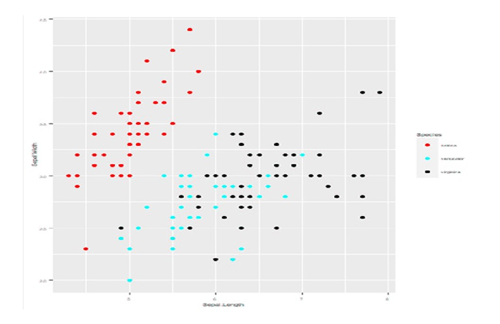

# Data Visualization

## Learning Objectives

1)  Understand the components of a graph

2)  Understand best practices in graph designs

[Lecture Link](https://docs.google.com/presentation/d/14i29O2C2Me9a-HM864ehLd43bP--d1LryDPUPJZ3Xvc/edit?usp=sharing)

What makes a good graph? According to Edward Tufte [@tufte_visual_1983], it is this:

> ...that which gives the viewer the greatest number of ideas in the shortest time with the least ink in the smallest space

> ...graphical excellence requires telling the truth about the data `r tufte::quote_footer('Edward Tufte - The Visual Display of Quantitative Information')`

We might consider these "high-level" guideposts to data visualization. It is tempting to think of this advice as applying only to modern scientific approaches, since anyone can create a graph on a computer. But Tufte's book is almost 40 years old. It is a masterpiece of data visualization that is as relevant today as it was in 1983. Tufte includes examples that extend back centuries. The principles that we try to apply in this book are not new. They are simply extensions of a long history of the study of how to best display data.

On a more fundamental level, we want to first focus on the basic components of common graphs.

A **graph** is a like a map whose coordinates are defined by cells in a table. It typically contains a vertical **y-axis** and a horizontal **x-axis**. The data are added to the graph by reading reading from columns in a table. In the example below, the data table has two columns corresponding to location data (lat = latitude, long = longitude). It is easy to see how this information would "map" to coordinates on a graph. The x-coordinates would be longitude and the y-coordinates would be latitude. Each pair of x-y coordinates would be a dot. Like this:

```{r echo=FALSE, fig.cap="a) First six rows of data, b) The same data plotted on an x-y coordinate with latitude (lat) on the y-axis and longitude (long) on the x-axis, c) The same plot, but with polygons of US States added for context.", fig.height=3, fig.width=16, message=FALSE, warning=FALSE, paged.print=FALSE}
library(tidyverse)
library(cowplot)
library(gridExtra)

map_d <- state.center %>% as_tibble() %>% rename(long = x, lat = y)
map_grob <- tableGrob(head(map_d))
map1 <- ggplot(map_d, aes(x = long, y = lat)) + 
  geom_point() +
  theme(text = element_text(size = 15))

state <- map_data("state")

map2 <- ggplot(map_d, aes(x = long, y = lat)) + 
  geom_polygon(data = state, aes(x = long, y = lat, group = group), fill = "grey80", 
               color = 'white') + 
  geom_point() +
  theme(text = element_text(size = 15))

plot_grid(map_grob, map1, map2, nrow = 1, labels = "auto")

```

**Why make a graph?** The table contains paired latitude and longitude coordinates, but unless you're a savant at geography, it might not be clear how the coordinates are related. By **plotting the data**, we are able to see patterns that would be difficult or impossible to see in the table. For example, the dots on the left side of (b) are more evenly spaced than the dots on the right side of (b). There are also some visual outliers, like the dot in the lower right, upper left, and lower left. There's nothing wrong with visual outliers. You'll see them in every graph you plot. But we would want to explore a little to see what they are. For example, by adding a polygon of US states, it becomes immediately clear what we're looking at. The lower right "outlier" isn't an outlier at all (We'll leave the jokes about Florida unsaid). There are still two dots that don't have states surrounding them - Alaska and Hawaii. These are still like outliers, but we intuitively know what they are by plotting. None of that information is in the table by itself.

### Basic Components of a Graph

Nearly all graphs share some basic features.

**y-axis** - Vertical axis. Often used to represent the *response* variable.

**x-axis** - Horizontal axis. Often used to represent the *predictor* variable.

**coordinates** - The x and y axis together form the coordinates of the plot.

**data** - The values of y for each value of x. Commonly shown as points.

**colors** - Used to distinguish different groups of data. Can be used to represent a separate response variable.

**shapes** - Used to distinguish different groups of data. Can be used to represent a separate response variable.

**lines** - Often used to show trends in the data.

These basic components form an enormous array of visualizations. Here's an example using the *iris* data set, which gives measures of flowers for three different species. It is included with R.

```{r echo=FALSE, message=FALSE, warning=FALSE, fig.width = 12, fig.height = 4, fig.cap = "a) First six rows of the iris data set, b) Scatterplot of the iris data, c) The same plot, but with a linear regression line for context. The blue line is the mean and the shading is the standard error of the mean. Color is also added to show a third variable for species."}

library(ggthemes)

iris_data <- iris %>% select(Petal.Length, Petal.Width, Species)
iris_grob <- tableGrob(head(iris_data))

iris_plot1 <- ggplot(iris, aes(x = Petal.Length, y = Petal.Width)) + 
  geom_point() +
  # geom_smooth(method = "lm") +
  labs(y = "Petal Width (cm)",
       x = "Petal Length (cm)") +
  theme(text = element_text(size = 15))

iris_plot2 <- ggplot(iris, aes(x = Petal.Length, y = Petal.Width)) + 
  geom_point(aes(color = Species)) +
  geom_smooth(method = "lm") +
  labs(y = "Petal Width (cm)",
       x = "Petal Length (cm)") +
  scale_color_colorblind() +
  theme(text = element_text(size = 15))

plot_grid(iris_grob, iris_plot1, iris_plot2, labels = "auto", nrow = 1, rel_widths = c(1, 1, 1.35))

```

The table and figures above follow the same sequence as the map before. We start with a table of data, where each row is an individual observation with information on petal length, petal width, and flower species. We then make an initial scatter plot, showing patterns that are hard or impossible to see just by looking at the table. Finally, we add a regression line and some colors for context.

Even though these graphs are for flowers and the previous graphs were for states, they share the same simple components, derived from data. We tell the graphing software where to find the data (*iris*), where to find the column for the **y-axis** (*Petal.Length*), the **x-axis** (*Petal.Width*), and where to find the column for **color** (*Species*). If we wanted to add another layer, like size of the individual, we would need to collect that data and simply add it as a fourth column in the data set.

### Best Practices

We see bad graphs all the time, from scientists at all levels (undergrad to Professor). Here are some common ways to make a bad graph.

**Recipe for a bad graph**

1)  Make the font really small

2)  Give really vague names to the axes

3)  Use lots of colors, particularly those that are impossible for color-blind people to distinguish

4)  Don't save the graph itself, just take a screenshot of it

5)  Paste it into your paper and pull the corners so the text is stretched

**Recipe for a better graph**

1)  Make the font readable in its final destination. Just because the font size is fine in R or Excel doesn't mean it will be fine when you import it to your paper

2)  Give informative names to the axes (e.g., "Income per capita (US\$)" instead of "Wealth")

3)  Choose color-blind friendly colors or try grayscale first <https://www.tableau.com/about/blog/2016/4/examining-data-viz-rules-dont-use-red-green-together-53463>

4)  Save the graph in a standard format, like .jpg, .png, or .svg

5)  If you're writing in Word, use the Import button in Word to import your graph. Don't copy and paste.

These simple steps will not ensure a good graph, but they will ensure that your graph is readable in its final form. Here's a comparison:

**Bad Graph**



```{r fig.height=8, fig.width=16, message=FALSE, warning=FALSE, include=FALSE, paged.print=FALSE}

# library(imager)
# library(cowplot)
# library(here)
# 
# bad_plot <- load.image(here("images/bad_plot.jpg"))
# 
# bad_plot.df <- plot(bad_plot) %>% as.data.frame(wide = "c") %>% 
#   mutate(rgb.val = rgb(c.1, c.2, c.2))
```

**Better Graph**

```{r echo=FALSE, fig.height=5, fig.width=7, message=FALSE, warning=FALSE, paged.print=FALSE}
library(imager)
library(cowplot)
library(here)

# bad <- ggplot(bad_plot.df, aes(x = x, y = y)) +
#   geom_raster(aes(fill = rgb.val)) + 
#   scale_fill_identity() +
#   scale_y_reverse() +
#   theme_void()


ggplot(iris, aes(x = Sepal.Length, y = Sepal.Width, color = Species)) + 
  geom_point(size = 3) +
  scale_color_colorblind() +
  theme(text = element_text(size = 15)) +
  labs(y = "Sepal Width (cm)",
       x = "Sepal Length (cm)")

# plot_grid(bad, better, nrow = 1, align = "v", rel_heights = c(1, 0.7))

```

These are the same data sets in two different graphs. The first one violates most of the rules for a bad graph (or follows most of the rules, I guess). The second one is better. It isn't pixelated and the text isn't stretched. The colors are visible even to a colorblind person (using `scale_color_colorblind()` from the *ggthemes* package). The axis labels are a bit more informative, giving the units for the sepal widths and lengths.

While this may seem like a trivial and obvious comparison, the first version is one we see all the time in student papers, and even in manuscripts submitted by PhDs. The easiest way to avoid this problem is to take the following steps:

1)  Create the graph in your software

2)  Save it as a high-resolution figure in a common format, like .jpg, .png, or .svg.

3)  Import it to your text document using the import button

4)  If it doesn't look right, delete it from the text document

5)  Return to step 1 and edit as needed

Using *ggplot* in R, we can save a high resolution version of our graph with the `ggsave()` function.

**Saving a high resolution graph**

```{r}
#make a plot with the built-in R dataset mtcars
my_graph <- ggplot(data = mtcars, aes(x = mpg, y = wt)) + geom_point()

#View the plot in R
my_graph

#Save the plot as a .jpg to our working directory
ggsave(my_graph, file = "my_graph.jpg", dpi = 500, width = 6, height = 6, units = "in")
```

The code above makes a graph called "my\_graph", calls the graph in R to view it, and then saves it as a .jpg with the `ggsave()` function. The `ggsave()` function has several options

**image type** - By adding ".jpg" to the end of our graph name in the `file = …` statement, we are creating a .jpg. To create a .png, just add ".png" instead. `ggsave()` can create 10 different file types - .png, .eps, .ps, .tex, .pdf, .jpg, .tiff, .bmp, .svg, or .wmf. Choose the one that works best for you.

**dpi** - dots per inch. The higher then number, the higher the resolution. However, increasing dpi also increases the file-size of your plot, which can make things really slow depending on your computer. A dpi of 500 or 600 is good for nearly all uses.

**width** - This sets the width of your graph.

**height** - This sets the height of your graph.

**units** - This sets the units for width and height. We put `units = "in"` above, which means that we're saving this graph to an expected size of 6x6 inches. If we set units to "cm", then it would be 6x6 cm and so on. Pick whatever measurement unit you are most comfortable with. We like inches because it is easy to imagine what a 6x6 inch graph would look like on a standard piece of 8x11.5 in paper. And because we grew up in the US, so the metric system is not as intuitive for us.
